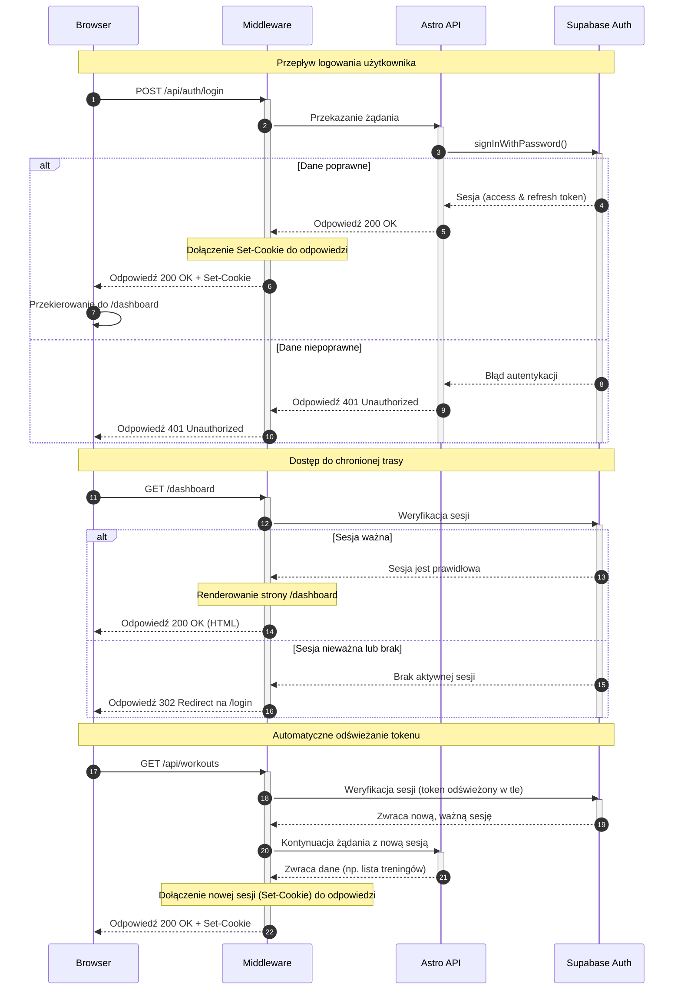

<authentication_analysis>
Na podstawie dostarczonych dokumentów, oto analiza przepływów autentykacji:

### 1. Zidentyfikowane przepływy autentykacji:

- **Rejestracja Użytkownika (Sign Up)**: Nowy użytkownik tworzy konto.
- **Logowanie Użytkownika (Sign In)**: Istniejący użytkownik uzyskuje dostęp do aplikacji.
- **Wylogowanie Użytkownika (Sign Out)**: Zalogowany użytkownik kończy sesję.
- **Resetowanie Hasła (Password Reset)**: Użytkownik inicjuje proces odzyskiwania hasła.
- **Aktualizacja Hasła (Update Password)**: Użytkownik ustawia nowe hasło po resecie.
- **Ochrona Tras (Route Protection)**: System uniemożliwia dostęp do chronionych stron niezalogowanym użytkownikom.
- **Odświeżanie Sesji (Token Refresh)**: Automatyczne odświeżanie wygasających tokenów JWT w tle.

### 2. Główni aktorzy i ich interakcje:

- **Przeglądarka (Browser)**: Interfejs użytkownika, z którego użytkownik inicjuje akcje (np. wypełnia formularz logowania). Renderuje komponenty React i strony Astro.
- **Middleware (Astro)**: Centralny punkt kontroli dla każdego żądania. Odpowiada za weryfikację sesji, ochronę tras i zarządzanie ciasteczkami sesji.
- **Astro API**: Dedykowane endpointy (np. `/api/auth/login`) obsługujące logikę biznesową autentykacji, komunikujące się z Supabase.
- **Supabase Auth**: Zewnętrzna usługa odpowiedzialna za zarządzanie tożsamością, wystawianie i weryfikację tokenów JWT.

### 3. Procesy weryfikacji i odświeżania tokenów:

- **Weryfikacja**: Przy każdym żądaniu do chronionej trasy, Middleware używa tokenu z ciasteczek, aby zweryfikować sesję w Supabase.
- **Odświeżanie**: Biblioteka kliencka Supabase automatycznie próbuje odświeżyć token dostępowy (access token) przy użyciu tokenu odświeżającego (refresh token), gdy ten pierwszy wygaśnie. Middleware przechwytuje nowe tokeny (zwracane w odpowiedzi z Supabase) i aktualizuje ciasteczka w przeglądarce użytkownika, zapewniając ciągłość sesji.

### 4. Opis kroków autentykacji (Przepływ logowania):

1.  Użytkownik wypełnia formularz logowania w komponencie React (`LoginForm.tsx`) i go wysyła.
2.  Komponent wysyła żądanie `POST` do endpointu `/api/auth/login` z e-mailem i hasłem.
3.  Żądanie jest przechwytywane przez Middleware, które inicjalizuje klienta Supabase z ciasteczkami z żądania.
4.  Endpoint `/api/auth/login` wywołuje `supabase.auth.signInWithPassword()`.
5.  Supabase Auth weryfikuje dane. W przypadku sukcesu generuje tokeny (access i refresh) i zwraca je do Astro API.
6.  Astro API zwraca odpowiedź 200 OK.
7.  Middleware przechwytuje odpowiedź, zauważa nagłówki `Set-Cookie` od Supabase, dołącza je do finalnej odpowiedzi i wysyła do przeglądarki.
8.  Przeglądarka zapisuje ciasteczka sesyjne.
9.  Komponent React, po otrzymaniu odpowiedzi 200 OK, przekierowuje użytkownika na stronę `/dashboard`.
10. Przy kolejnym żądaniu (np. do `/dashboard`), Middleware odczyta nowe ciasteczka, pomyślnie zweryfikuje sesję i zezwoli na dostęp.

</authentication_analysis>

<mermaid_diagram>

</mermaid_diagram>
