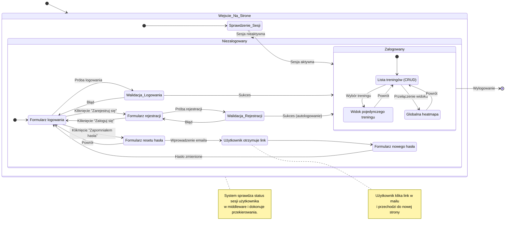

<user_journey_analysis>
Na podstawie dostarczonych dokumentów, oto analiza podróży użytkownika w kontekście autentykacji:

### 1. Zidentyfikowane ścieżki użytkownika:

- **Ścieżka nowego użytkownika**: Od wejścia na stronę, przez rejestrację, aż do uzyskania dostępu do panelu głównego.
- **Ścieżka powracającego użytkownika**: Logowanie do systemu w celu uzyskania dostępu do swoich danych.
- **Ścieżka odzyskiwania dostępu**: Proces resetowania hasła dla użytkownika, który go zapomniał.
- **Ścieżka zalogowanego użytkownika**: Interakcja z głównymi funkcjami aplikacji (dashboard, heatmapa) oraz proces wylogowania.

### 2. Główne podróże i ich stany:

- **Podróż "Gość" (Niezalogowany)**:
  - Stan początkowy: Wejście na stronę.
  - Stany pośrednie: Przekierowanie na stronę logowania, możliwość przejścia do rejestracji lub resetu hasła.
  - Cel: Skierowanie użytkownika do odpowiedniej akcji (logowanie/rejestracja).
- **Podróż "Rejestracja"**:
  - Stan początkowy: Wyświetlenie formularza rejestracji.
  - Stany pośrednie: Wypełnienie danych, walidacja, utworzenie konta.
  - Stan końcowy: Użytkownik jest automatycznie zalogowany i widzi Dashboard.
  - Cel: Szybkie i bezproblemowe utworzenie konta.
- **Podróż "Logowanie"**:
  - Stan początkowy: Wyświetlenie formularza logowania.
  - Stany pośrednie: Wypełnienie danych, walidacja, weryfikacja poświadczeń.
  - Stan końcowy: Użytkownik widzi Dashboard.
  - Cel: Umożliwienie dostępu do aplikacji istniejącym użytkownikom.
- **Podróż "Reset Hasła"**:
  - Stan początkowy: Formularz z prośbą o e-mail.
  - Stany pośrednie: Wysłanie linku resetującego, przejście na stronę aktualizacji hasła, ustawienie nowego hasła.
  - Stan końcowy: Przekierowanie na stronę logowania z komunikatem o sukcesie.
  - Cel: Bezpieczne odzyskanie dostępu do konta.
- **Podróż "Zalogowany"**:
  - Stan początkowy: Widok Dashboardu.
  - Stany pośrednie: Zarządzanie treningami, przeglądanie heatmapy.
  - Stan końcowy: Wylogowanie i powrót do strony logowania.
  - Cel: Korzystanie z podstawowych funkcji aplikacji.

### 3. Punkty decyzyjne i alternatywne ścieżki:

- **Wejście na stronę (`/`)**: System sprawdza, czy użytkownik ma aktywną sesję. Jeśli tak, przekierowuje do `/dashboard`. Jeśli nie, do `/login`.
- **Strona logowania**: Użytkownik może podjąć decyzję o zalogowaniu się, przejściu do rejestracji (`/register`) lub zainicjowaniu resetu hasła (`/password-reset`).
- **Walidacja formularzy**: Zarówno przy logowaniu, jak i rejestracji, błędne dane powodują wyświetlenie komunikatu o błędzie i pozostanie w tym samym stanie (na formularzu), zamiast przejścia dalej.
- **Ochrona tras**: Próba bezpośredniego wejścia na chronioną stronę (np. `/dashboard`) bez aktywnej sesji skutkuje przekierowaniem do `/login`.

### 4. Opis celu każdego stanu:

- **Strona Główna (`/`)**: Pełni rolę routera, kierując użytkownika w odpowiednie miejsce na podstawie jego statusu uwierzytelnienia.
- **Strona Logowania**: Centralny punkt dla niezalogowanych użytkowników, oferujący opcje logowania, rejestracji i odzyskiwania hasła.
- **Strona Rejestracji**: Umożliwia nowym użytkownikom dołączenie do serwisu.
- **Strona Resetowania Hasła**: Inicjuje proces odzyskiwania konta.
- **Strona Aktualizacji Hasła**: Finalizuje proces resetu, pozwalając na ustawienie nowego hasła.
- **Dashboard**: Główny widok dla zalogowanego użytkownika, prezentujący listę jego treningów i umożliwiający zarządzanie nimi.
- **Heatmapa**: Alternatywny widok dla zalogowanego użytkownika, wizualizujący wszystkie jego aktywności.

</user_journey_analysis>

<mermaid_diagram>

</mermaid_diagram>
