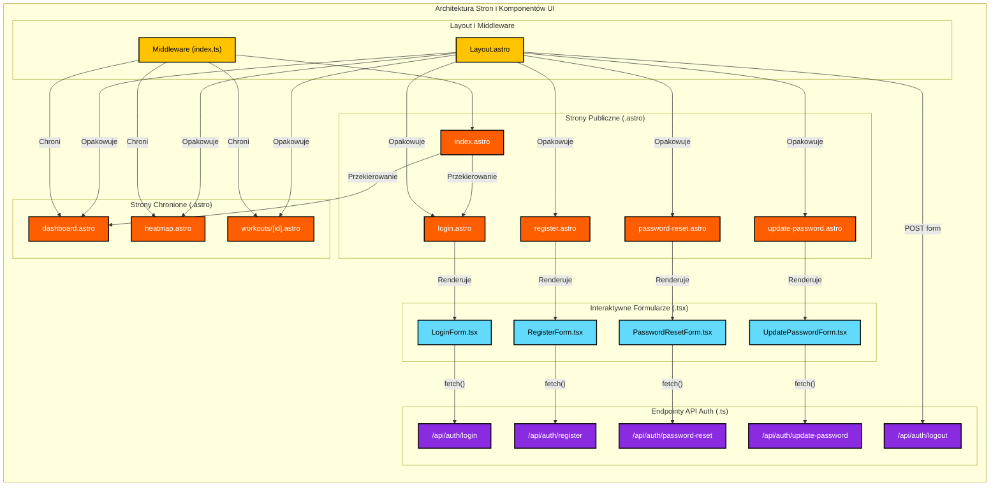

<architecture_analysis>
Na podstawie dostarczonych dokumentów, oto analiza architektury UI dla modułu autentykacji:

### 1. Zidentyfikowane komponenty i strony:

**Strony Astro (`src/pages/`):**

- `index.astro`: Główny punkt wejściowy, przekierowujący na podstawie sesji.
- `login.astro`: Strona hostująca formularz logowania.
- `register.astro`: Strona hostująca formularz rejestracji.
- `password-reset.astro`: Strona hostująca formularz resetu hasła.
- `update-password.astro`: Strona hostująca formularz aktualizacji hasła.
- `dashboard.astro`: Chroniona strona z listą treningów.
- `heatmap.astro`: Chroniona strona z widokiem heatmapy.
- `workouts/[id].astro`: Chroniona strona z widokiem pojedynczego treningu.

**Komponenty React (`src/components/auth/`):**

- `LoginForm.tsx`: Interaktywny formularz logowania.
- `RegisterForm.tsx`: Interaktywny formularz rejestracji.
- `PasswordResetForm.tsx`: Interaktywny formularz do inicjowania resetu hasła.
- `UpdatePasswordForm.tsx`: Interaktywny formularz do ustawiania nowego hasła.

**Layouty i Komponenty Modyfikowane:**

- `Layout.astro`: Główny layout aplikacji, który będzie warunkowo renderował nawigację w zależności od statusu zalogowania.

**Endpointy API (`src/pages/api/auth/`):**

- `login.ts`, `register.ts`, `logout.ts`, `password-reset.ts`, `update-password.ts`: Logika backendowa obsługująca żądania z komponentów React.

### 2. Główne strony i ich komponenty:

- Strona `login.astro` będzie renderować w sobie komponent `LoginForm.tsx`.
- Strona `register.astro` będzie renderować `RegisterForm.tsx`.
- Strona `password-reset.astro` będzie renderować `PasswordResetForm.tsx`.
- Strona `update-password.astro` będzie renderować `UpdatePasswordForm.tsx`.
- Wszystkie strony będą opakowane w `Layout.astro`.

### 3. Przepływ danych między komponentami:

1.  Użytkownik wchodzi na stronę `.astro` (np. `login.astro`).
2.  Strona Astro renderuje statyczną strukturę i osadza w niej interaktywny komponent React (np. `LoginForm.tsx`).
3.  Komponent React zarządza swoim stanem (dane formularza, błędy walidacji).
4.  Po akcji użytkownika (np. kliknięcie "Zaloguj"), komponent React wysyła żądanie `fetch` do odpowiedniego endpointu API Astro (np. `POST /api/auth/login.ts`).
5.  Endpoint API przetwarza żądanie, komunikuje się z Supabase, a następnie zwraca odpowiedź (sukces lub błąd).
6.  Komponent React odbiera odpowiedź i aktualizuje swój stan (np. wyświetla błąd) lub wykonuje przekierowanie po stronie klienta.

### 4. Opis funkcjonalności każdego komponentu:

- **`index.astro`**: Działa jak router. Sprawdza `Astro.locals.user` i przekierowuje do `/login` (brak zalogowania) lub `/dashboard` (user zalogowany).
- **Strony `.astro` z formularzami**: Służą jako "hosty" dla komponentów React, dostarczając kontekst renderowania po stronie serwera.
- **Komponenty `.tsx` z formularzami**: Odpowiadają za całą interaktywność formularzy, walidację po stronie klienta i komunikację z API.
- **`Layout.astro`**: Odpowiada za spójny wygląd aplikacji i renderuje nawigację odpowiednią dla zalogowanego lub niezalogowanego użytkownika.
- **Chronione strony (`dashboard.astro` itp.)**: Ich dostęp jest weryfikowany w `middleware`. Jeśli użytkownik nie jest zalogowany, zostanie przekierowany.

</architecture_analysis>

<mermaid_diagram>

</mermaid_diagram>
